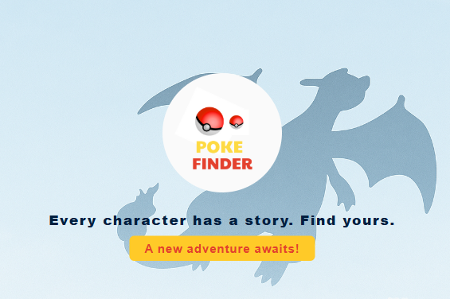

# 🐾 Poke Finder

To choose your adventure partner, you must first know them all.
**Poke Finder** lets you search, explore, and learn about Pokémon from the **first generation (1–151)** ⚡

_Visual elements used in this project respect authorship rights.  
Logos and images were designed by me or come from royalty-free sources or AI-generated assets._

---

## 🖼️ Screenshots

**Landing Page**  

---

## ✨ Features

- Search Pokémon by **name** in real time.
- Expandable **info cards** showing:
  - Base experience
  - Type
  - English description (from PokéAPI)
- Custom landing page inspired by the Game Boy style.
- Navigation between pages using React Router.

## 🛠 Technologies & Workflow

### 🧠 Core Technologies

- ⚛️ **React + Vite** – Frontend framework and fast development environment.
- 🧭 **React Router** – For client-side navigation between pages.
- 🌐 **PokéAPI** – Open REST API used as the data source: [https://pokeapi.co](https://pokeapi.co)
- 🎨 **CSS Flexbox** – To structure and style the layout responsively.

### 🧩 Version Control & Collaboration

- 🧠 **Git + GitHub** – Used for version control and project hosting.
- 🚀 **GitHub Pages** – For static deployment from the `/docs` folder after Vite build.

### 🌱 Branching Strategy

To demonstrate **professional Git practices** and an **iterative development process**, I used two branches:

- **`main`** → The stable, production-ready version containing the first functional commit (landing + name search).
- **`dev`** → Development branch used to add and test new features, such as the **experience filter** before merging.

This approach helps keep the main branch clean and allows working in small, testable iterations —  
a practice inspired by **Agile** and **Git Flow** methodologies.

---

## 🚀 Deployment

The app is deployed via **GitHub Pages**.  
A Vite build script moves the compiled project into the `/docs` folder,  
so GitHub can serve it directly from the `main` branch.

---

**Catch them all, Trainer!** ⚡🎮

> “Gotta catch ’em all!”

---

## 🇪🇸

# 🐾 Poke Finder

Para elegir a tu compañero de aventura, primero tienes que conocerlos a todos.
**Poke Finder** te permite buscar y descubrir los Pokémon de la **primera generación (1–151)** ⚡

_Los elementos visuales respetan los derechos de autor. Los logotipos y gráficos fueron diseñados por mí o generados mediante IA._

---

## ✨ Funcionalidades

- Buscar Pokémon por **nombre** en tiempo real.
- Ver **cartas desplegables** con imagen, tipo, experiencia y descripción.
- Navegación entre la **landing page** y el buscador.

---

## 🛠 Tecnologías y flujo de trabajo

### 🧠 Tecnologías principales

- **React + Vite** - Stack moderno y rápido para desarrollo.
- **React Router** - Navegación entre vistas.
- **PokéAPI** - Fuente de datos pública y gratuita.
- **CSS Flexbox** - Diseño adaptable y limpio.

### 🧩 Control de versiones

- **Git + GitHub** – Control de versiones y despliegue.
- **GitHub Pages** – Publicación del proyecto desde la carpeta `/docs`.

### 🌱 Uso de ramas

Para mostrar **buenas prácticas de desarrollo**, trabajé con dos ramas:

- `main` → Rama estable, con la primera versión funcional.
- `dev` → Rama de desarrollo donde añadí la **nueva funcionalidad del filtro por experiencia**.

---

**¡Hazte con todos!** ⚡🎮
